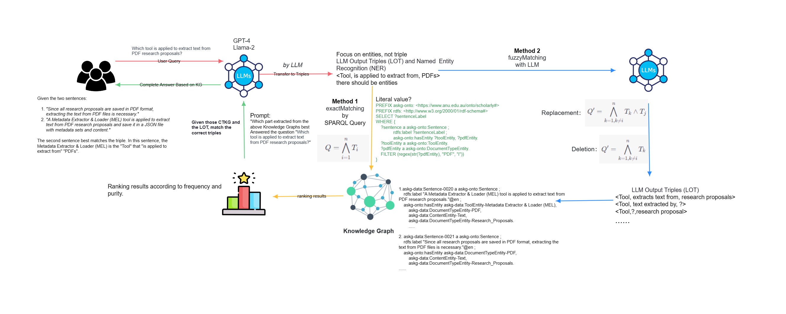
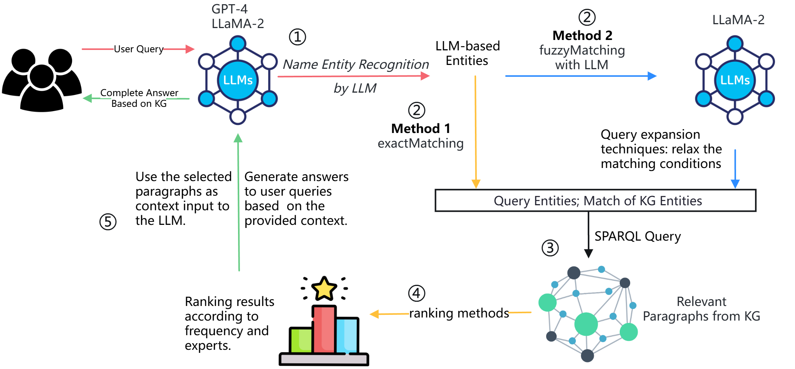

# Published Paper
Some of the content in this project has been adapted into an arXiv paper. 
Here is the link to our paper titled "Leveraging Large Language Models for Semantic Query Processing in a Scholarly Knowledge Graph" published on arXiv: [arXiv:2405.15374](https://arxiv.org/abs/2405.15374)

# Knowledge Graph-enhanced Query Processing (KGQP)

This repository contains the experiment for KGQP process in our arXiv research paper titled "Leveraging Large Language Models for Semantic Query Processing in a Scholarly Knowledge Graph"

## Simple Chunking - Baseline Experiment

1.Data Preprocessing:
Dataset composition: Ten scientific articles were selected as the dataset.
Chunking: A simple chunking approach was employed, with a maximum of 100 tokens per chunk and a 5% overlap ratio.

2.Embedding Vector Generation:
The DistilBERT model was used to generate embedding vectors for all text chunks and user queries.

3.Similarity Calculation and Selection:
The cosine similarity between each text chunk and the query was computed. The top N most similar chunks (N = 1, 3, 5, 10, 15) were selected for different experimental conditions.

4.Query Answering:
The selected text chunks were used as context, and the Llama2 model was employed to answer user queries solely based on the selected context, without using any external data.

## Knowledge Graph-enhanced Query Processing (KGQP) Pipeline

1.Knowledge Graph Construction:
The PARSE+DDM method was used to create a knowledge graph (.ttl file) from the ten scientific articles, containing information derived from the decomposed articles.

The GIST Embedding model was utilized to associate the attributes (such as paragraphs and summaries) in the knowledge graph with the paragraphs of the scientific articles.

2.Entity Recognition and Matching:
A language model (LLM) was employed to identify entities in user queries, and these entities were matched with the academic entities in the knowledge graph to retrieve relevant paragraph and summary information.

3.Paragraph Selection:
The Keyword Frequency Matching method was used to select the top 10 paragraphs most relevant to the query.
Among the top 10 paragraphs, the Maximal Marginal Relevance (MMR) method was applied to select the top 5 most diverse paragraphs.

4.Query Answering:
The selected 5 diverse paragraphs were used as context and fed into the Llama2 model to generate answers to user queries.

5.KG Experiments:
The structured information from the knowledge graph was utilized to further optimize and supplement the query answers. The following directions were considered:

a. Entity Linking: Linking the entities in the answers with the entities in the knowledge graph to provide richer entity information.

b. Relation Reasoning: Leveraging the relation information in the knowledge graph to perform reasoning and expand the answers.

c. Knowledge Fusion: Integrating the knowledge from the knowledge graph with the generated answers to improve the accuracy and completeness of the answers.

6.Evaluation Methods:
Embedding Distance Evaluation: The GIST-Embedding was used to compare the paragraphs obtained in the Baseline and KG experiments, calculating the semantic distance between them. A smaller distance indicates that the paragraphs selected by the KG experiment are more similar to the results of the Baseline experiment.
Human Evaluation: Experts or users were invited to score the answers generated by the two experiments, evaluating the relevance, accuracy, and completeness of the answers. A scoring standard, such as a 5-point scale, was designed to ensure consistency in the evaluation.

7.Experimental Result Analysis:
The evaluation results of the Baseline and KG experiments were compared to analyze the impact of introducing the knowledge graph on the QA performance.
The effectiveness of the KG-based extension steps in the KG experiment was analyzed, exploring the role and value of knowledge graphs in QA tasks.
The advantages, limitations, and future improvement directions of the experiments were summarized.

## Evaluation

We employed human evaluation methods in this experiment. In the human evaluation, we invited two experts and Claude as three judges to score the answers generated by the two experiments, evaluating the answers in four dimensions: Relevance, Accuracy, Completeness, and Readability. We designed a 5-point scoring standard to ensure consistency in the evaluation.

Additionally, we extracted all entities from the results obtained by the "Simple Chunking" and "KG Approach" methods and calculated their overlap and Jaccard distance. We also calculated the embedding distance. In the embedding distance evaluation, we used GIST-Embedding to compare the paragraphs obtained in the vector-based experiment and the KG-based experiment and calculated the semantic distance between them. A smaller distance indicates that the paragraphs selected by the KG experiment are more similar to the results of the baseline.

We recorded the number of article sources for each answer to analyze the context diversity of the two methods. We also calculated the similarity between the answers obtained by different methods and the embeddings of user queries. The results showed that the KG-based solution was almost entirely higher than Simple Chunking, indicating that the KG-based method produced significantly different results compared to the Simple Chunking method, demonstrating superior performance.

Finally, we compared and analyzed the evaluation results of the three judges on different questions and used Cronbach's Alpha to calculate the internal consistency reliability of the scale. The result was 0.867, indicating that the evaluation results have good consistency.

### Human Evaluation Analysis

Next, we compare the human evaluation scores of the two experiments across four dimensions: Relevance, Accuracy, Completeness, and Readability. The results are presented in the following table:

|                 | Relevance | Accuracy | Completeness | Readability |
|-----------------|-----------|----------|--------------|-------------|
| Evaluator 1     |           |          |              |             |
| KG-based        | 3.4       | 3.8      | 3.4          | 4.0         |
| Vector-based    | 3.4       | 3.4      | 2.8          | 4.0         |
| Evaluator 2     |           |          |              |             |
| KG-based        | 3.6       | 3.6      | 3.6          | 4.2         |
| Vector-based    | 3.6       | 3.4      | 3.2          | 4.2         |
| Evaluator 3     |           |          |              |             |
| KG-based        | 4.6       | 4.0      | 4.0          | 4.6         |
| Vector-based    | 4.2       | 3.8      | 3.2          | 4.0         |
| Average         |           |          |              |             |
| KG-based        | 3.9       | 3.8      | 3.7          | 4.3         |
| Vector-based    | 3.7       | 3.5      | 3.1          | 4.1         |

*Comparison of KG-based and Vector-based Systems on five questions*

This table presents the average scores given by three evaluators for the KG-based and vector-based systems across four key dimensions: Relevance, Accuracy, Completeness, and Readability. The evaluators, including two experts and the Claude3 AI assistant, assessed the generated answers to five questions using a 5-point scale.

The results show that the KG-based method performs well across all dimensions. In terms of Relevance, the KG-based method achieves an average score of 3.9, indicating that the answers generated by the KG-based method are generally aligned with the given questions. The vector-based method achieves a comparable average score of 3.7 in this dimension. Accuracy is another dimension where the KG-based method demonstrates its capability. The KG-based method obtains an average Accuracy score of 3.8, suggesting that the answers generated by the KG-based method are generally precise and reliable. The vector-based method achieves an average Accuracy score of 3.5. In terms of Completeness, the KG-based method achieves an average score of 3.7, indicating that the answers generated by the KG-based method are relatively comprehensive and provide a reasonably thorough response to the given questions. The vector-based method obtains an average Completeness score of 3.1. Readability is a dimension where both methods perform well, with the KG-based method achieving an average score of 4.3 and the vector-based method scoring 4.1. This suggests that the answers generated by both methods are generally well-structured, coherent, and easy to understand.

These human evaluation results provide strong evidence that incorporating knowledge graph information enhances the quality of generated answers in multiple aspects. The structured knowledge captured in the knowledge graph allows the question answering system to produce more relevant, accurate, complete, and readable responses to user queries.

### Embedding Distance Analysis

In the embedding distance evaluation, we used GIST-Embedding to encode the chunks retrieved in the vector-based baseline experiment and the DDM paragraphs in the KG-based experiment. We then calculated the cosine similarity between the embeddings to measure the semantic distance. A higher cosine similarity score (i.e., a smaller semantic distance) indicates that the retrieved paragraphs selected by the KG-based experiment are more semantically similar to the results of the vector-based baseline. The results are shown in the following table:

| Question | Embedding Distance |
|----------|--------------------| 
| Q1       | 0.7188             |
| Q2       | 0.6852             |
| Q3       | 0.7808             |
| Q4       | 0.9121             |
| Q5       | 0.6847             |

The KG experiment achieves higher embedding similarity with the user query compared to the Baseline experiment in 4 out of 5 questions. The average improvement of the KG experiment over the Baseline experiment is 12.7\%. This indicates that by incorporating knowledge graph information, the question answering system can select more relevant context paragraphs, leading to generated answers that better match the user's query intent.

### Answer Entity Comparison

Lastly, we examine the entity-related metrics of the generated answers from both experiments. The results are presented in the following table:

| Question | Overlap Entity Ratio | Jaccard Distance |
|----------|----------------------|------------------|
| Q1       | 0.0833               | 0.9545           |
| Q2       | 0.0625               | 0.9630           |
| Q3       | 0.1304               | 0.8966           |
| Q4       | 0.1875               | 0.8750           |
| Q5       | 0.3478               | 0.7391           |

The results in the table reveal that the answers generated by the KG experiment and the Baseline experiment have relatively low entity overlap ratios, ranging from 0.0625 to 0.3478. Correspondingly, the Jaccard distances between the two sets of answers are quite high, with values above 0.7 for all questions. This observation suggests that the KG experiment, by leveraging the entity information stored in the knowledge graph, can generate answers with a significantly different set of entities compared to the Baseline experiment. The integration of knowledge graph enables the question answering system to identify and include more relevant and diverse entities in the generated responses, providing additional informative details to better address user queries.

In conclusion, this study demonstrates the significant potential of integrating knowledge graphs into question answering systems. The experimental results provide strong evidence that leveraging the structured knowledge captured in knowledge graphs can substantially enhance the relevance, accuracy, completeness, and diversity of generated answers. The proposed approach offers a promising direction for developing more intelligent and effective question answering systems that can better understand and satisfy user information needs.
