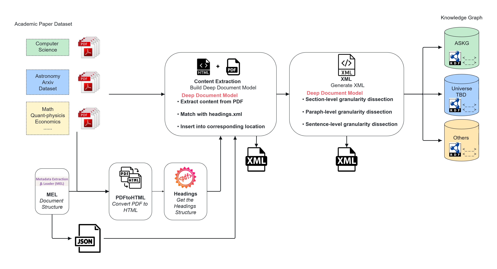
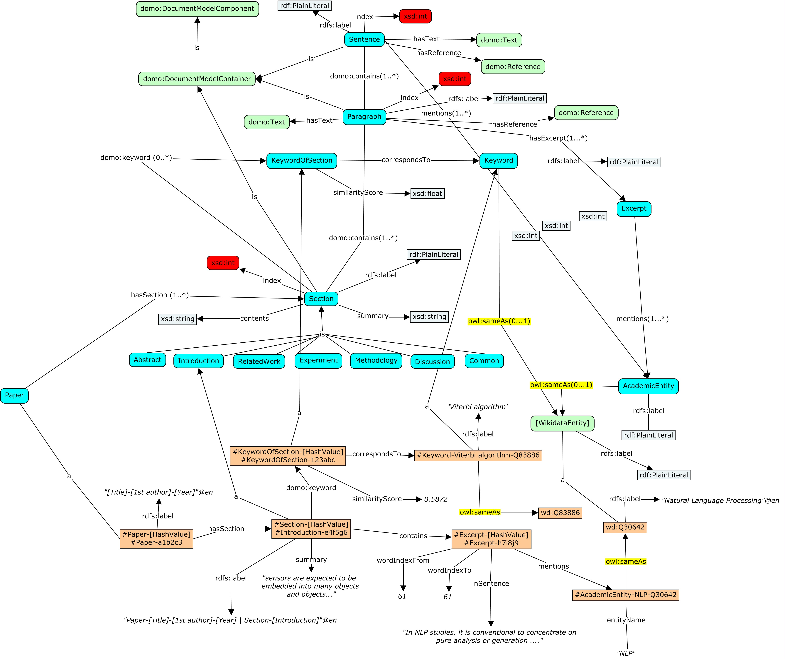

# Deep Document Model (DDM)

This repository contains the code related to the *Deep Document Model* (**DDM**) implementation in the *Academic Scholarly Knowledge Graph* (**ASKG**) project.  It aims to investigate an approach to enrich scholarly knowledge graphs through paper decomposition. Our project's primary focus is to expand ASKG automatically by extracting fine-grained knowledge from academic papers, particularly those related to computer science.

## DDM Pipeline

The pipeline graph shows the entire DDM construction process: 

1. Converting PDF files to HTML format.
2. Extracting headings from the HTML and constructing an XML representation of the document structure.
3. Extracting textual content from the PDF and splitting it into sentences.
4. Aligning sentences with the corresponding section information from the XML structure.
5. Embedding references within the sentences.
6. Generating the final DDM XML representation.

Initially, the academic document is transitioned from PDF to HTML format using the PDFtoHTML tool, facilitating the extraction of its hierarchical heading structure. This is subsequently integrated with the outcomes derived from the MEL Document Structure and the original PDF document, culminating in the formation of the Deep Document Model. The process commences with the extraction of content from the PDF file, segmenting it into individual sentences. These sentences are then meticulously aligned with the headings obtained from the XML document, ensuring their accurate placement within the appropriate sections. The model functions at various levels of granularity, encompassing sections, paragraphs, and singular sentences. It also identifies any references as specific embeddings linked to those sentences. Ultimately, the XML document is converted into RDF, thereby enriching the Scholarly Knowledge Graph. This enrichment paves the way for additional applications, notably facilitating interactions with LLMs as explored in this paper.

## Multi-granularity Representation

In the specific construction process of the document model, based on hierarchical decomposition, we developed a model encapsulating the logical structure of the document, integrating relationships and component attributes (such as importance, relevance) into the model. For ease of subsequent processing and analysis, this model is serialized into XML or JSON format. Below is an XML example of the multi-granularity representation.

```xml
<section>
<section ID="1">
  <heading>Introduction</heading>
  <sentence>In the 21st century, the importance of developing cutting-edge scientific research is self-evident for every country.</sentence>
    <reference>1</reference>
  <sentence>Usually, the government research funding agencies receive thousands of research proposals each year, which are reviewed only by expert panels.    
  </sentence>
</section>
<section ID="2">
  <heading>Related Work</heading>
  <section ID="2.1">
    <heading>Computer science in evaluating grant applications</heading>
    <sentence>Oztaysi et al.</sentence>
    <sentence>
    proposed a multi-criteria approach to evaluate research proposals based on interval-valued intuitionistic fuzzy sets.
      <reference>2</reference>
    </sentence>
    <sentence>
    Besides the IC score, reviewers also score several other assessment scores, such as "Feasibility Score" or "Significance Score." </sentence>
    <sentence>
    A Metadata Extractor and Loader (MEL) tool is applied to extract text from PDF research proposals and save it in a JSON file with metadata sets and content.
      <reference>20</reference>
    </sentence>
    <sentence>
    By default, all JSON files are stored in CouchDB database based on the proposal index.
      <reference>21</reference>
    </sentence>
```

As shown above, it constructs a document structure containing multiple levels of granularity. In the chunked part, each section is defined by a `<section>` and uniquely identified by an ID. The document includes titles (using `<heading>`) and text content (using `<sentence>`), as well as related reference numbers (using `<reference>`). Moreover, the code demonstrates how to nest different sections, forming a hierarchical document structure.

Additionally, we have developed a visualization tool to intuitively display the structure and content of the document, facilitating user understanding and exploration.

## ASKG Ontology Expansion with DDM

This section describes the inclusion of the DDM into the ASKG ontology. The ASKG ontology formally specifies the concepts, relationships, and properties relevant to the academic domain, especially academic papers. By incorporating the DDM into the ASKG ontology, we ensure that the structured representation of the documents is compatible with the existing knowledge graph, enabling seamless integration and interoperability.

This process involves defining the elements and structure of the DDM with corresponding classes and properties described in the ASKG ontology. In this manner, a semantic correspondence between the DDM representation and the ontology is established, allowing for the integration of the extracted information into the knowledge graph.

The concept map below shows the enriched ASKG ontology after including the DDM aligned with the DOMO ontology:


This illustrates the ontological representation of DDM's structure. The main classes from the ASKG ontology, such as `Paper`, `Section`, `Paragraph`, and `Sentence`, are aligned with the corresponding elements in the DDM. The hierarchical relationships, such as `hasSection`, `hasParagraph`, and `hasSentence`, are used to represent the containment structure. The attributes, such as the title of a paper or the text of a sentence, are mapped to the appropriate datatype properties in the ontology. 

## RDF Mapping

To integrate the DDM into ASKG, the XML representation of DDM needs to be mapped to the RDF format representation of ASKG. RDF is a standard model for representing structured data on the web and serves as the foundation for building knowledge graphs based on the W3C Semantic Web technologies. By mapping DDM's XML to RDF, we enable the integration of the extracted document information into the ASKG.

To facilitate the mapping process, we use the [RDF Mapping Language (RML)](https://rml.io/specs/rml/). RML is a declarative language that allows defining mapping rules to transform data from various formats into RDF. RML provides a flexible and expressive way to map the XML elements and attributes of DDM to RDF triples.

```turtle
@prefix askg: <http://example.org/askg/> .
@prefix rdf: <http://www.w3.org/1999/02/22-rdf-syntax-ns#> .
@prefix xsd: <http://www.w3.org/2001/XMLSchema#> .

askg:Paper1 rdf:type askg:Paper ;
  askg:title "An Analysis of Deep Learning Techniques"^^xsd:string ;
  askg:hasSection askg:Section1 .

askg:Section1 rdf:type askg:Section ;
  askg:heading "Introduction"^^xsd:string ;
  askg:hasParagraph askg:Paragraph1 .

askg:Paragraph1 rdf:type askg:Paragraph ;
  askg:hasSentence askg:Sentence1 .

askg:Sentence1 rdf:type askg:Sentence ;
  askg:text "Deep learning has revolutionized various domains, including computer vision and natural language processing."^^xsd:string ;
  askg:hasReference askg:Reference1 .

askg:Reference1 rdf:type askg:Reference ;
  askg:referenceId "1"^^xsd:string .
```

By mapping DDM's XML representation to RDF using RML, we transform DDM's hierarchical structure into a graph-based representation that can be seamlessly integrated into the ASKG. The resulting RDF data enables efficient querying, reasoning, and knowledge discovery over the integrated document information.

## Enriched ASKG Ontology: Complete Concept Map

